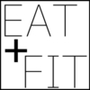
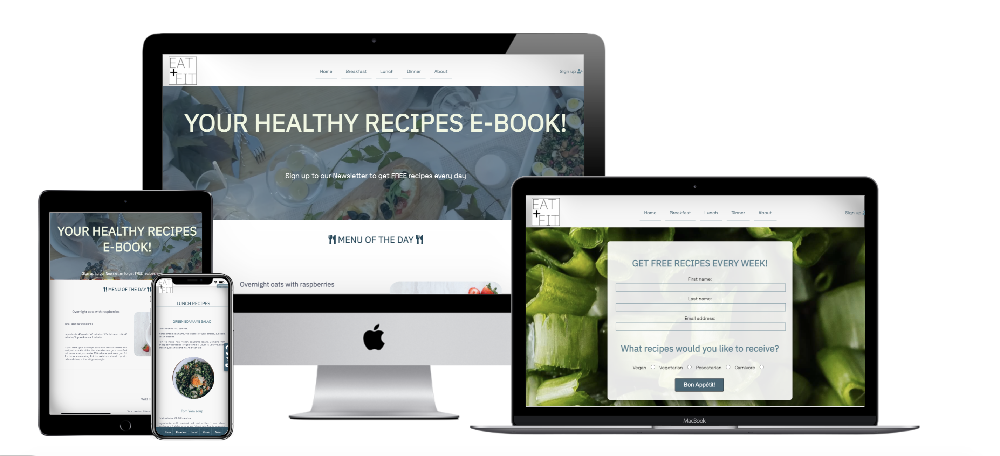
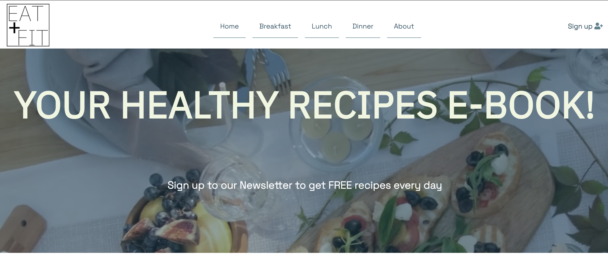
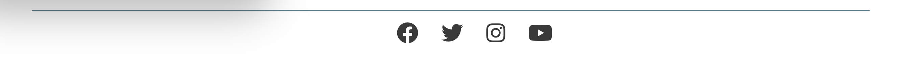
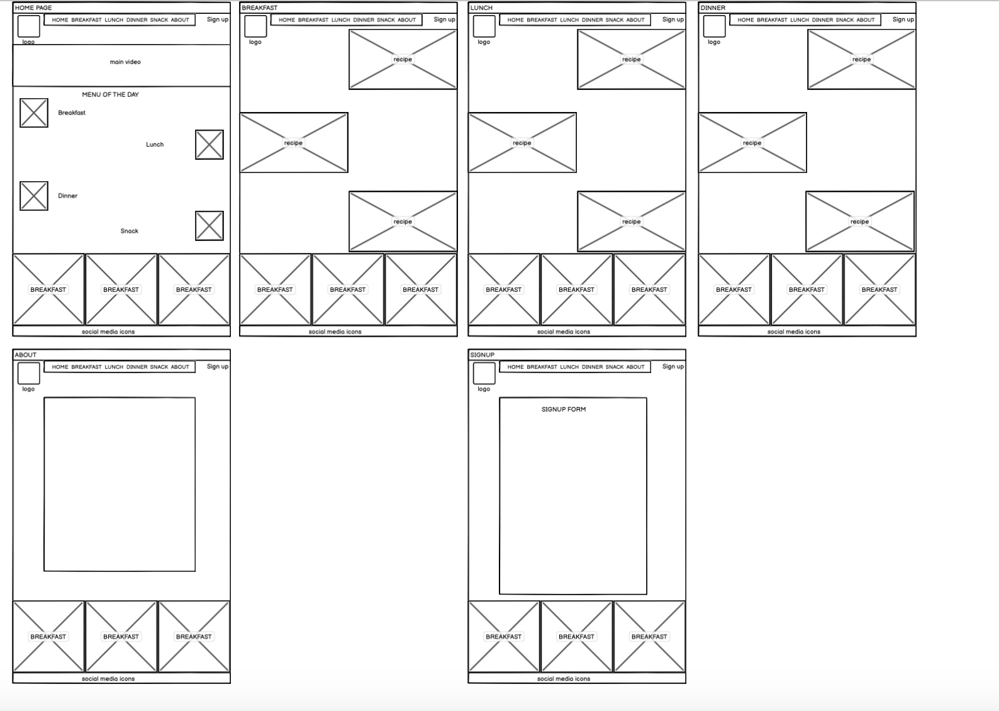
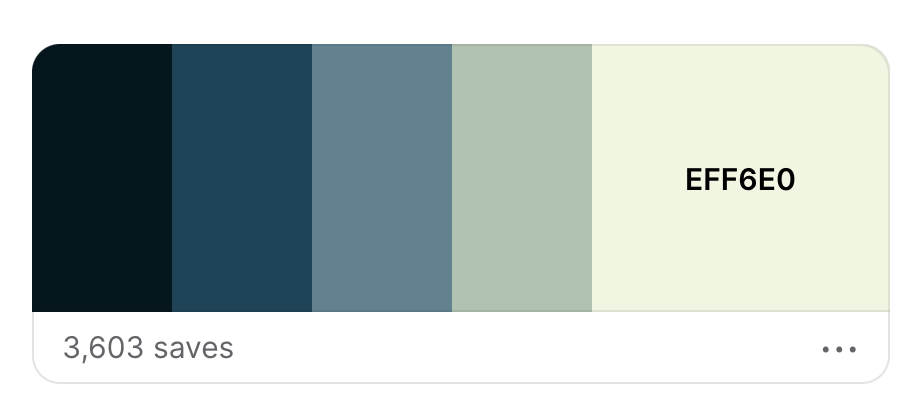
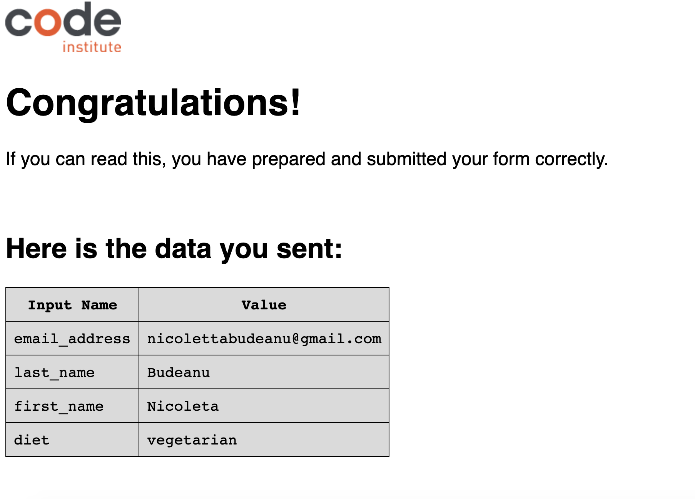
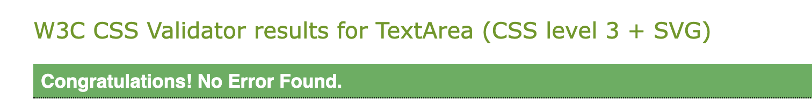

 

## Eat+Fit is a website for people out there looking for a healthy recipes e-book. It is made for people who are interested in having a healthy lifestyle, who are passionate of cooking and want to find out more about nutrition. The users of this website will find breakfast, dinner and lunch healthy recipes along with the calories and ingredients needed.

### Also, they will be able to sign for a newsletter in order to get new personalized weekly recipes on their email. The website targets all people of age 15 and above who are eating healthy and passionate of cooking.

 

# FEATURES

Responsive on DESKTOP, TABLET and MOBILE screens.

### HOME PAGE
The main page of EAT+FIT consists of a navigation bar, a menu of the day which changes on a daily basis, explore section and the footer. When arrived on EAT+FIT, you will first see the main video and a welcome message.

Link to the home page : https://nikkibudeanu.github.io/my-first-project/index.html

### NAVIGATION BAR 
The navigation bar is featured on all 6 pages. The navigation bar will allow the user to easily navigate from page to page across all devices without the need to use the ‘back’ button. It includes links to all 6 pages and a logo(created by me). It is identical on all pages in order to ensure consistency and a positive user experience.
 

On tablet and mobile screens, it switches to a bottom navigation menu. 

### LOGO 

The logo was created in Canva and I used the same font family as the headings "IBM PLEX SANS".

### MENU OF THE DAY
This section is made to be changed on a daily basis and it contains a breakfast, lunch and dinner recipe of the day. It includes total calories, the recipe and images. 

### EXPLORE SECTION
This section's purpose is to provide quicker access to BREAKFAST, LUNCH and DINNER pages. It contains 3 clickable images with links to the recipe pages. The Explore section is only available on tablet and desktop screens and not on mobile ones. 

### FOOTER
The footer contains icons with links to the social media platforms. 

On mobile and tablet screens, it switches to the right side of the screen in a fixed position to allow users to quicker navigate on our social media platforms from any page. 

### ABOUT PAGE
This page contains a couple of videos along with "who are we" and "why eat healthy" sections which are going to help our users learn more about the purpose of this website. 

Link to the About page: https://nikkibudeanu.github.io/my-first-project/about.html 

### BREAKFAST, DINNER, LUNCH pages
These pages are similar to each other and they include recipes along with pictures. They also contain the footer, hyperlinks section and the navigation bar. 

Links: 
* https://nikkibudeanu.github.io/my-first-project/breakfast.html
* https://nikkibudeanu.github.io/my-first-project/lunch.html
* https://nikkibudeanu.github.io/my-first-project/dinner.html

### SIGN UP PAGE
This page will allow users to sign up for a weekly newsletters with recipes. It includes a signup form where the users will have to add their last name, first name and email. 

# STRATEGY 

## User stories

As a user, I want to:
* See the Menu of the Day.
* Be able to access the three pages : Breakfast, Lunch, Dinner and explore all recipes listen there. 
* Be able to view full recipes with images, ingredients and calorie count. 
* Navigate easily from page to page and spot the nav bar on all screens. 
* Access the website's social media pages easily by clicking on the footer icons. 
* Easly navigate from page to page when scrolling down the website by clicking on the explore section's images. 
* Understand what I am signing up for and be able to do it. 

## Project goals
The primary goal of EAT+FIT is to serve to its users as an e-book free, quick and healthy recipes and to be an user friendly platform with an appealing and intuitive design that allows users to explore the recipes, learn about us and signup for our newsletter. 

## User goals
The user is looking for:
* An e-book with healthy recipes on an easy to use, fun and modern website. 

The target user is:
* Age: 15+
* People interested in a healthy lifestyle.
* People passionate of cooking. 

## Site owner's goals
* Provide free recipes and daily update the menu of the website.
* Gather a community through newsletter and share recipes with them on a weekly basis. 

# SCOPE

# STRUCTURE

## Navbar: 
Home, BREAKFAST, LUNCH, DINNER, About Sign Up

##  Home Page: 
Main Video, Menu of the Day, Explore section with hyperlinked images, footer. 

## BREAKFAST, LUNCH, DINNER Page: 
Recipes with ingredients, total calories and images. 

## About Page
"Who we are" and "Why eat healthy" sections.

## Signup Page 
Signup form, submit button, explore section with hyperlinked images, footer. 

# SKELETON 

Mockups were created using Balsamiq Wireframes. 

# SURFACE 

## Color 
* The color palette was selected on the website below:

https://coolors.co/palettes/trending/#598392

## Typography

* Space Grotesk is used as the main font and IBM plex sans is the font used for the Headings.  

https://www.fontpair.co/pairing/space-grotesk-ibm-plex-sans

## Imagery

* The website consists of more than 20 images downloaded from Pexels. The main video was selected because it is bright and settles the mood of the websites. 

# TESTING
* I tested Eat+fit on various browsers: Safari, Google Chrome, Mozilla Firefox. 
* I confirmed that all the website features are easy to understand and readable. 
* I confirmed that the navigation bar and footer works on different screen sizes. 
* I passed the Lighthouse Developper tool's report with more than 90% for all pages. 

* I confirmed the form works on mobile and desktop screen. It has entry requirements and the submit button is functionable. 

* I confirmed that all images have passed through tiny.png in order to make sure the loading time is not too long and our users have a smooth user experience. 

* The Website was viewed on a variety of devices such as Desktop, Laptop, iPad and different Android and iOS Phones.

### Validator Testing

* HTML
No errors were found when passing the W3C validator.

* CSS
No errors were found when passing the W3 jigsaw validator.

### Bugs

* The main video of the screen was positioned a few pixels from the left of the screen and I eventually figured that there is an automatic margin which needs to be set to 0 in order to avoid issues like these. 

* When deployed, I would get an error that github cannot find the files. The problem was caused by choosing the wrong option when deploying the website to github pages: files instead of root. 

* I was using % for font and positioning, instead of using pixels/rem. It caused some issues as I always needed to change the font size for various screen sizes. 

* Initially, for breakfast, lunch and dinner pages, I used a different flexbox for each recipe and the code was way too long. It took me some time to realize that I can use the same class for each recipe and only write a few lines to style all 3 pages. 

#### Unfixed bugs
* I have noticed that at some instances, the main video is not responsive on iOS. I did some research and figured that iOS does not acces mp4 files. Therefore, I decided to convert my mp4 file to a mpeg file but the video was not responsive at all. I figured this issues after my call with the mentor and unfortunately, I could not fix it. 

# Deployment
EAT+FIT  was deployed to GitHub pages. 

The steps to deploy are as follows:
* In the GitHub repository, navigate to the Settings tab
* Scroll down the Settings page until you locate the "GitHub Pages" Section.
* Under "Source", click the drop down called "None" and select "Main Branch".

Link: https://nikkibudeanu.github.io/my-first-project/index.html 

# Credits

### Content
Recipes were taken from the websites below:

* http://recipeofhealth.com/recipe/oladi-russian-pancakes-320811rb
* https://loseweightbyeating.com/avocado-toast-recipes/
* https://www.healthline.com/nutrition/overnight-oats-recipes#1.-Basic-overnight-oats
* https://kaynutrition.com/edamame-salad/
* https://www.yummly.com/recipes/quinoa-salad-low-calorie 
* https://www.bbcgoodfood.com/recipes/italian-style-stuffed-aubergines
* https://www.verywellfit.com/creamy-spicy-pumpkin-soup-2242417
* https://www.quorn.co.nz/recipes/vegan-nuggets-salad-bowl

### Media 
All images/videos were taken from Pexels. 

### Code 
The box shadow code was taken from the website below:

https://getcssscan.com/css-box-shadow-examples

## Acknowledgements
* My mentor for continuous assesement and insightful resources and feedback. 

